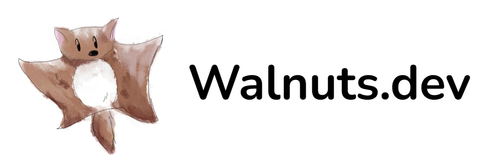

    

  
  
  
  

# Infra

walnuts.dev を支える技術

Walnuts 家の自宅サーバ全般のリポジトリです。

## Kubernetes Manifests

- [README](./k8s/README.md)

## Actions

- [k8s-badge](./.github/workflows/badge.yaml)
- [CI](./.github/workflows/k8s.yaml)

## Renovate

- [renovate.json](./renovate.json5) 
